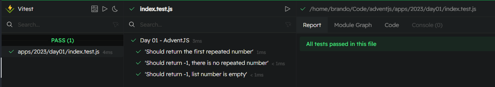

# 🎁 First gift repeated!!

### Solution

```javascript
export default function findFirstRepeated (gifts) {
  const seen = new Set()

  for (const id of gifts) {
    if (seen.has(id)) return id
    seen.add(id)
  }
  return -1
}
```

### Test

```javascript
import { describe, expect, test } from 'vitest'
import findFirstRepeated from './index.js'

const cases = [
  {
    title: 'Should return the first repeated number',
    collection: [2, 1, 3, 5, 3, 2],
    expected: 3
  },
  {
    title: 'Should return -1, there is no repeated number',
    collection: [1, 2, 3, 4],
    expected: -1
  },
  {
    title: 'Should return -1, list number is empty',
    collection: [],
    expected: -1
  }
]

describe('Day 01 - AdventJS', () => {
  test.each(cases)('$title', ({ collection, expected }) => {
    expect(findFirstRepeated(collection)).toEqual(expected)
  })
})
```

### Screenshot



[Back to the table of challengues](/README.md)
