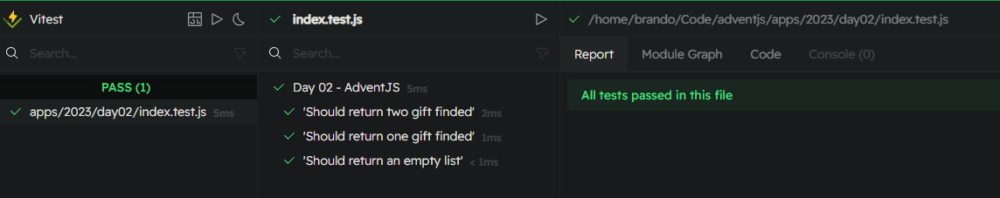

# 🎁 First gift repeated!!

### Solution

```javascript
export default function findFirstRepeated (gifts) {
  const seen = new Set()

  for (const id of gifts) {
    if (seen.has(id)) return id
    seen.add(id)
  }
  return -1
}
```

### Test

```javascript
import { describe, expect, test } from 'vitest'
import manufacture from './index.js'

const cases = [
  {
    title: 'Should return two gift finded',
    gifts: ['tren', 'oso', 'pelota'],
    materials: 'tronesa',
    expected: ['tren', 'oso']
  },
  {
    title: 'Should return one gift finded',
    gifts: ['juego', 'puzzle'],
    materials: 'jlepuz',
    expected: ['puzzle']
  },
  {
    title: 'Should return an empty list',
    gifts: ['libro', 'ps5'],
    materials: 'psli',
    expected: []
  }
]

describe('Day 01 - AdventJS', () => {
  test.each(cases)('$title', ({ gifts, materials, expected }) => {
    expect(manufacture(gifts, materials)).toEqual(expected)
  })
})

```

### Screenshot



[Back to the table of challengues](/README.md)
